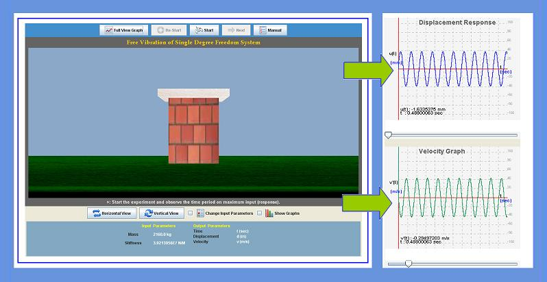

Free vibration is a vibration in which energy is neither added to nor removed from the vibrating system. It will just keep vibrating forever at the same amplitude or a structure is said to be undergoing free vibration when it is disturbed from its static equilibrium position without any external dynamic excitation.

To understand the behavior of single degree of freedom system vibrating with initial excitation (i.e, initial displacement and/or initial velocity and with or without damping).

 
 
