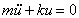
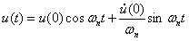

Free vibration is initiated by disturbing the system from its static equilibrium position by imparting the mass some displacement u(0) and velocity u’(0) at time t=0. 
There are two cases in free vibration  
1. undamped free vibration  
2. damped free vibration  

**Undamped free vibration :**
The governing equation for undamped free vibration is  

    

where, 
m = mass ,u'' = acceleration, k = stiffness, u = displacement. 
The solution to homogeneous equation is : 

  

where, 
u(0) = initial displacement ,u'(0) = initial velocity. 
Here in this solution we can observe that the system will vibrate only if initial displacement and/or initial velocity is given. 

To read about the Theory of the experiment click [here](docs/2.theory.pdf)
